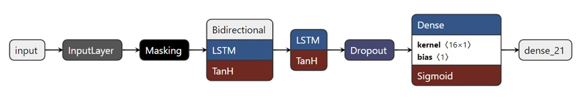

# Informed Clinical Decision Making using Deep Learning

## Data Mining of Clinical Databases

    
     

- week01: 
   - Big Data in Healthcare
   - EHR System in the UK and USA
   - MIMIC Critical Care Dataset: The Impact
   - Data Usage Requirements
- week02:
   - MIMIC-III Data Linkage
   - MIMIC-III as a Relational Database
   - MIMIC-III - Descriptive Statistics
   - Vital Signs Extraction for a Single Patient
- week03
   - Introduction to International Classification of Disease System
   - Evolution of the ICD System
   - ICD-9 and MIMIC-III
   - From ICD-9 to ICD-10 (ICD-11)
- week04
   - Concepts in MIMIC III
   - Relation of Catheterization to Mortality: An Example Study
   - Data Extraction

##  Deep Learning in Electronic Health Records

    
     

- week01: 
   - Deep Learning and Artificial Intelligence
   - Multi-Layer Perceptron
   - Optimization of a Multi-Layer Perceptron (Part 1)
   - Optimization of a Mutli-Layer Perceptrion (Part 2)
   - Preprocessing of ECG Signal
- week02:
   - Validation of Machine Learning Models
   - Convolutional Neural Networks
   - Recurrent Neural Networks   
- week03
   - Benchmark Deep Learning Models with EHR - Part 1
   - Benchmark Deep Learning Models with EHR - Part 2
   - Imputation Strategies
   - Deep Learning Imputation Strategies
- week04
   - Categorical and Continuous Variables
   - Bayesian Target Encoding
   - Encodings Inspired from NLP
   - Other Types of Embeddings

## Explainable Deep Learning Models for Healthcare

    
     

- week01: 
   - Interpretability vs Explainability
   - 'Explainability' in Healthcare Applications
   - Taxonomy of Explainability Methods
   - Model Agnostic Explainability Methods
   - Permutation Feature Importance in Time Series Data
- week02:
   - Local Interpretable Model Agnostic Explanations (LIME)
   - LIME in Time-Series Classification
   - Shapley Additive Explanations
   - Model-Specific Explanations: Visualisation Methods
   - CAM in Time-Series Classification
- week03
   - Gradient Weighted Class Activation Maps
   - Grad-CAM in Time-Series Classification
   - Integrated Gradients
   - Integrated Gradients in Time Series Classification
- week04
   - Attention in Deep Learning
   - Taxonomy of Attention
   - Attention and Explainability
   
## Clinical Decision Support Systems
- week01: 
   - From Reproducibility to Generalisability
   - A Guide to Model Validation in Clinical Decision Support Systems
   - Calibration of Deep Learning Models
- week02:
   - Assessment of the Risk of Bias in EHR
   - Fairness in Machine Learning for Healthcare Applications (Part 1)
   - Fairness in Machine Learning for Healthcare Applications (Part 2)
- week03
   - Decision Curve Analysis
   - Human-Centered Clinical Decision Support Systems
   - Evaluation of Explainability Models
- week04
   - Privacy Concerns in CDSS
   - Defences Against Inference Attacks
   - Adversarial Attacks - Explainability

